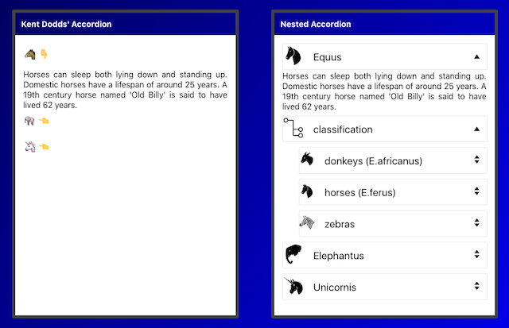
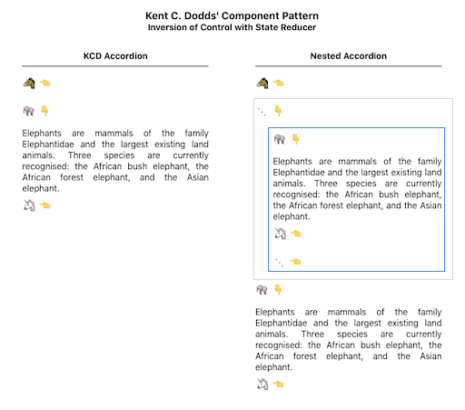

## Inversion of Control Software Pattern [(demo)](https://nested-accordion.herokuapp.com/)

### _Fighting prop-bloat and maintenance blues in your React components_


_<h6>Photo by <a href="https://unsplash.com/@rxcroes?utm_source=unsplash&amp;utm_medium=referral&amp;utm_content=creditCopyText">Raoul Croes</a></h6>_

I'm investigating **inversion of control**, a software design principle I recently [discovered](https://kentcdodds.com/blog/inversion-of-control) from Kent Dodds.

Here, I riff on an example of Kent's to add recursive behavior to his Accordion component through three reducers:

- input data reducer
- layout reducer
- behavior reducer

[](https://nested-accordion.herokuapp.com/)

## [Contents](#contents)

- [The Problem](#imagine)
- [A Solution](#a-solution)
- [Case Study: Nested Accordion](#case-study-nested-accordion)
  - [Input Data](#input-data)
  - [Input Reducer](#input-reducer)
  - [Layout Reducer](#layout-reducer)
  - [singlePeer Expansion Reducer](#singlePeer-expansion-reducer)
  - [focalIndex feature](#focalIndex-feature)
  - ### [**Demo**](https://nested-accordion.herokuapp.com/) ☚
- [Summary](#summary)
- [Conclusion](#conclusion)

## [Imagine ...](#contents)

You've written a new _Accordion_ component with a set of props to support a reasonable collection of use-cases.

 _<h6>Accordion by <a href="https://kentcdodds.com">Kent Dodds</a></h6>_

You want to share your work with others, so you publish and blog a bit. You feel great.

 _<h6>Photo by <a href="https://unsplash.com/@stobbewtf?utm_source=unsplash&amp;utm_medium=referral&amp;utm_content=creditCopyText">Christian Paul Stobbe</a></h6>_

In time, the gods of SEO and open source smile and you're rewarded with the blessings of growing interest and adoption. You bask in the glow of acknowledged value and happily respond to the natural influx of feature requests.

 _<h6>Photo by <a href="https://unsplash.com/@dryanparker?utm_source=unsplash&amp;utm_medium=referral&amp;utm_content=creditCopyText">Ryan Parker</a></h6>_

With popularity, comes a steady drum beat of new questions, use-cases, and bug reports. Some in the community contribute pull requests, thankfully, but these are not free as they require time and effort to consider and shape.

Your prop count grows. You diligently add test cases for the scenarios you at least understand but feel less definitive about others, especially the ones you'll never need yourself, frankly.

 _<h6>Photo by <a href="https://unsplash.com/@t_ahmetler?utm_source=unsplash&amp;utm_medium=referral&amp;utm_content=creditCopyText">Tolga Ahmetler</a></h6>_

As code complexity grows, it's hard keeping up with the demand for modifications while still maintaining quality. The crisp coherence of your original component morphs into a maintenance muddle.

Has your gift to the world become a curse, an albatross around your neck?


_<h6>By <a href="https://en.wiktionary.org/wiki/albatross_around_one%27s_neck">
Gustave Doré, 1876</a>
[ <a href="https://commons.wikimedia.org/wiki/Template:PD-US">CC-PD-Mark</a> ]</h6>_

Is there a way to pass control _back_ to the flock of eager adoptees with an implementation that _encourages_ extension without _you_ having to rewrite the underlying component at each turn?

## [A Solution](#contents)

### _Inversion of Control_

I've recently become a fan of Kent Dodds after watching his two **Simply React** keynotes from [2018](https://youtu.be/AiJ8tRRH0f8) and [2020](https://youtu.be/5io81WLgXtg) where he discusses **inversion of control** in the context of a highly extensible Accordion component pictured above.

The key points are:

- expose layout logic for easy modification by clients
- support extensible component behavior through chainable, developer-supplied state reducers

You still craft reasonable defaults for layout and behavior to meet your needs (and hopefully those of many others). However, if you allow one or more DIY behavior reducers to be passed in, then you may side-step the need to anticipate or laboriously support variant policies. For the Accordion, behavior variants might be:

- only allow 1 visible item at a time
- require at least 1 item be visible at all times
- allow multiple visible items

Wouldn't it be nice if you didn't have to code all those variants yourself as the author of the Accordion component?

The code below illustrates how a consumer of your component may select the behavior they want based upon an `expansionReducer` prop that defines how state should change when a user clicks on an accordion item. If different behavior is desired, the developer may write their _own_ reducer without going through the component maintainer.

```javascript
import React from 'react'
import { Accordion } from './Accordion'
import {
  combineExpansionReducers,
  preventCloseReducer,
  singleExpandedReducer,
} from './useExpandable'

const items = [
  {
    title: '🐴',
    contents: (
      <div>
        Horses can sleep both lying down and ...
      </div>
    )
  },
  ...
]

function App() {
  return (
    <Accordion
      items={items}
      expansionReducer={combineExpansionReducers(
        singleExpandedReducer, // :-)  Only allow 1 item to be selected.
        preventCloseReducer    // :-)  At least 1 item should visible.
      )}
    />
  )
}
```

### So how does this all work?

The optional `expansionReducer` prop is key.

An expansion reducer manages a stateful array of indices which controls the visibility of Accordion items. Here's a reducer that allows only one accordion item to be visible at a time:

```javascript

# useExpanded.js

function singleExpandedReducer(expandedItems = [], action) {
  if (action.type === actionTypes.toggle_index) {
    const openIt = !expandedItems.includes(action.index)
    if (openIt) {
      return [action.index] // Replace expandedItems with a new array
                            // that includes a single open item.
    }
  }
}

```

During render, entries in the `expandedItems` array are injected into lower-level components as `isOpen` props:

```javascript
# useAccordion.js

  (
    <AccordionItem>
      ...
      <AccordionContents
        isOpen={action.expandedItems.includes(index)}> // :-)
        {contents}
      </AccordionContents>
    </AccordionItem>
  )

```

which control expandable divs ...

```javascript
# useAccordion.js

import posed from 'react-pose'

const PoseAccordionContents = posed.div({
  open: { maxHeight: 200 },
  closed: { maxHeight: 0 }
})

function AccordionContents({ isOpen, ...props }) {
  return (
    <PoseAccordionContents
      pose={isOpen ? 'open' : 'closed'}  // :-)
      style={{ overflowY: 'hidden', textAlign: 'justify' }}
      {...props}
    />
  )
}
```

By default, a user may click to open multiple items.

Developers may _override_ that behavior by redefining which reducers will fire in response to item clicks.

Control is _inverted_ by enabling the component consumer to extend behavior in their scope rather than blocking on the PR / merge cycle to get their novel use-case into the underlying component.

**Hmm ... that gives me an idea.**

I've been playing with menu drawers that open to the side of the main content and allow a user to navigate a hierarchy of selectable options. The options themselves often expand to reveal sub-options. The expansion behavior of the accordion reminds me of that.

Could I create my own Accordion state reducer to enable _nested_ Accordions ... as a step toward a drawer list component?

## [Case Study: Nested Accordion](#contents)

### _Creating a recursive Accordion_


_<h6>Photo by <a href="https://unsplash.com/@nunchakouy?utm_source=unsplash&amp;utm_medium=referral&amp;utm_content=creditCopyText">Jossuha Théophile</a></h6>_

I want something that looks like [this](https://nested-accordion.herokuapp.com/):

[](https://nested-accordion.herokuapp.com 'nested accordion')

with recursively defined input data:

```javascript

# App.js

import React from 'react'
import { Accordion } from './Accordion'

const nestedItems = [
  {
    title: '🐴',
    contents: (
      <div>
        Horses can sleep both lying ...
      </div>
    )
  },
  {
    title: '⋯',
    items: [        // <--- the recursive bit
      {
        title: '🐘',
        contents: (
          <div>
            Elephants are mammals of the ...
          </div>
        )
      },
      ...
    ]
  }
  ...
]
```

and a usage pattern that looks very similar to what we've seen already:

```javascript

# App.js

function App() {
  return (
    <Accordion
      items={nestedItems}
      expansionReducer={???}
    />
  )
}
```

I also want a very spare implementation for the Accordion component itself. It shuttles item data into a useAccodion hook and get a renderable array of React components back. All click handling and expansion-state behavior will be managed somewhere below that (in a useExpandable hook):

```javascript

# Accordion.js

import React from 'react'
import { useAccordion } from './useAccordion'

function Accordion(props) {
  const { items, ...optional } = props
  const { components } = useAccordion({ items, ...optional })
  return <div>{components}</div>
}

```

### [Input Data](#contents)

The first challenge are the input data. The current render process maps across a linear array of items:

```javascript
const items = [
  {
    title: '🐴',
    contents: (
      <div>
        Horses can sleep both lying down and ...
      </div>
    )
  },
  {
    title: '🐘',
    contents: (
      <div>
        Elephants are mammals of the family Elephantidae ...
      </div>
    )
  },
  ...
]

... // hand waving

(
  return items.map((item, index) => (
    return <AccordionItem>...</AccordionItem>
  ))
)
```

### [Input Reducer](#contents)

For the recursive Accordion, we have nested input data. So how can we make that work while leveraging the existing implementation? Should we override the layout code with something recursion-friendly or maybe flatten the input data before it gets mapped?

I opt for the latter to minimize changes to the underlying component since that's the point of this pattern.

I come up with this:

```javascript
function flattenItemsReducer(nestedItems, depth = 0, acc = [], parent) {
  const flattenedItems = nestedItems.reduce((acc, item, index) => {
    const hasNestedItems = item.items
    if (hasNestedItems) {
      acc.push({
        // parent node
        title: item.title,
        contents: undefined,
        depth: depth,
        parent: parent
      })
      const newParent = acc.length - 1
      return flattenItemsReducer(item.items, depth + 1, acc, newParent)
    } else {
      acc.push({
        // child node
        ...item,
        depth: depth,
        parent: parent
      })
    }
    return acc
  }, acc)
  return flattenedItems
}
```

This linearizes our nested input data into a 1-dimensional array by injecting
`parent nodes` just above their children.

It also adds `depth` and `parent` properties to the item schema so we can implement [hierarchies of visibility](https://github.com/zenglenn42/inversion-of-control/blob/a2683ab2ff9700b988a784acdd4ea5a385c56553/src/components/hooks/useAccordion.js#L97), [layout indentation](https://github.com/zenglenn42/inversion-of-control/blob/a2683ab2ff9700b988a784acdd4ea5a385c56553/src/components/hooks/useAccordion.js#L59), and [peer-centric behavior](https://github.com/zenglenn42/inversion-of-control/blob/a2683ab2ff9700b988a784acdd4ea5a385c56553/src/App.js#L147).

Out of expedience, I break my own rule and wedge this into `useAccordion.js` for now. Heh, that didn't take long. I suspect _some_ of Kent's code will get refactored as I hear the siren call of an **[inputItemsReducer](https://github.com/zenglenn42/inversion-of-control/blob/e6e0ecbef71c12ed68a67a9b16607d928865a58c/src/components/hooks/useAccordion.js#L181)** prop.
The nice thing about this reducer, I further rationalize, is it works with flat _and_ nested input data.

Here's how it integrates into the useAccordion hook:

```javascript

# useAccordion.js

import {
  useExpandable,
  multiExpandedReducer as dfltExpansionReducer
} from './useExpandable'

function useAccordion(items = []) {
  // Flatten input items as necessary. :-)
  const normalizedItems = useRef(flattenItemsReducer(items))

  // Gain access to stateful array of expandedItems (for layout)
  // managed by Kent's extensible state reducers.
  const { expandedItems, toggleItem } = useExpandable({
    initialState: [],
    reducer: dfltExpansionReducer,
    items: normalizedItems.current
  })

  // Watch this space :-)
  useEffect(() => trigger_component_layout()), [???])
  return { components }   // somehow ...
}
```

### [Layout Reducer](#contents)

Next we consume the flattened data by passing it to a layout reducer:

```javascript

# useAccordion.js

function verticalBelowLayoutReducer(components, action) {
  switch (action.type) {
    case layoutActionTypes.map_items:
      return action.items.map((item, index) => {
       if (isVisible(item, action.items, action.expandedItems)) {
          return (
            <AccordionItem
              key={`${item.depth}_${item.title}_${index}`}
              direction="vertical"
              indent={item.depth}
            >
              {createButton(
                index,
                action.expandedItems.includes(index),
                action.toggleItem,
                item.title,
                '👇',
                '👈'
              )}
              {createContents(
                action.expandedItems.includes(index),
                item.contents
              )}
            </AccordionItem>
          )
        }
        return createEmptyItem(item.depth, index)
      })
    default: {
      throw new Error(
        'Unhandled type in verticalBelowLayoutReducer: ' +
          action.type
      )
    }
  }
}

...

function useAccordion(items) {
  // Flatten input items as necessary.
  const normalizedItems = useRef(flattenItemsReducer(items))

  // Gain access to stateful array of expandedItems (for layout)
  // managed by Kent's extensible state reducers.
  const { expandedItems, toggleItem } = useExpandable({
    initialState: [],
    reducer: expansionReducer,
    items: normalizedItems.current
  })
  const memoizedToggleItem = useCallback(toggleItem, [])

  // Watch this space :-)

  // Turn verticalBelowLayoutReducer() into a true layout reducer
  // ... so we can return React components to caller
  const memoizedLayoutReducer = useCallback(verticalBelowLayoutReducer, [])
  const [components, dispatch] = useReducer(memoizedLayoutReducer, [])

  // ... and dispatch layout actions sync'd to caller's render
  useEffect(() => {
    dispatch({
      type: layoutActionTypes.map_items,
      items: normalizedItems.current,
      toggleItem: memoizedToggleItem,
      expandedItems: expandedItems || []
    })
    return
  }, [normalizedItems, memoizedToggleItem, expandedItems])
  return { components }
}

```

### [singlePeer Expansion Reducer](#contents)

Finally, I implement the recursive analog of the `singleExpandedReducer` that allows at most a single item to be expanded at any one time. I amend this to allow a single _peer_ item to be visible at a time:

```javascript

# App.js

import { actionTypes as expandableActionTypes } from './useExpandable'

// Allow only one peer item at a given nested depth to be visible.

function singlePeerExpandedReducer(expandedItems = [], action) {
  function isaParent(item) {
    return item.contents === undefined
  }
  function removePeersOf(index, array, items) {
    const depth = items[index].depth
    return array.filter(
      (i) =>
        items[i].depth !== depth ||
        // don't remove peers that are parents of sub-accordions
        (items[i].depth === depth &&
          (isaParent(items[i]) || isaParent(items[index])))
    )
  }
  if (action.type === expandableActionTypes.toggle_index) {
    return expandedItems.includes(action.index)
      ? // closeIt
        expandedItems.length > 1
        ? expandedItems.filter((i) => i !== action.index)
        : undefined // allow combineReducers to chain reducers
      : // openIt
        [
          ...removePeersOf(action.index, expandedItems, action.items),
          action.index
        ]
  }
}

...

function App() {
  return (
    <Accordion
      items={nestedItems}
      expansionReducer={singlePeerExpandedReducer}
    />
  )
}

```

### [focalIndex feature](#contents)

Okay, I can't resist adding one [feature](https://github.com/zenglenn42/inversion-of-control/commit/12e2a993040f3aebedc77ea226d644ec4d987ab2).

I'd like to add some styling for the title section of a selected item ... a gray background perhaps.


Kent's original code uses a '&:focus' idiom with the styled Emotion button component to achieve this effect. However, when I upgrade to the latest version of that library, I hit either a regression or maybe a porting goof on my part. Weirdly, '&:hover' still seems to work just fine.

But this has me thinking.

If I had access to the index of the most recently clicked item, I could use _that_ for prop-driven background styling. Even better, it could drive some react-router code to display more interesting content, like a related youtube video in its own dedicated section. This fits with my other goal of evolving the component into a slideout menu drawer where you're also manipulating routes and components in reaction to menu clicks.

So I [augment](https://github.com/zenglenn42/inversion-of-control/commit/12e2a993040f3aebedc77ea226d644ec4d987ab2) the state managed by useExpandable to include a `focalIndex` in addition to the `expandedItems` array.

Now I can style against that state by overriding the default layout logic in useAccordion with my nesting-aware layout function:

```javascript
# NestedAccordion.js

function nestedLayoutReducer(components, action) {
  ..
  return action.allItems.map((item, index) => {(
      <AccordionItem>
        <AccordionButton isOpen={isOpen} onClick={() => toggleFn(index)} >
          <div
            style={{
              display: 'inline-flex',
              width: '100%',
              padding: '0.125em 0',
              borderRadius: '0.125em',
              backgroundColor: index === focalIndex ? '#ddd' : 'inherit'
            }}
          >
          ..
          </div>
          </AccordionButton>
      </AccordionItem>
  )})
}
```

The replacement layout reducer is referenced as a prop in the Accordion:

```javascript
# App.js

import { Accordion } from './components/Accordion/Accordion'
import { nestedItemsClosure } from './components/NestedAccordion/NestedAccordion'

const nestedItems = [..];

function App() {
  return (
    <Accordion
      items={nestedItems}
      inputItemsReducer={nestedItemsClosure()}
      layoutReducer={nestedLayoutReducer}
    />
  )
}
```

## [Summary](#contents)

I've sketched out a nested Accordion that supports input-data and layout reducers (in addition to Kent's expansion state reducer).

Here's what I learned:

- Input data reducers

  - Input data for a nested Accordion are [inherently nested](https://github.com/zenglenn42/inversion-of-control/blob/f0dd950ca8d2b5f76942c39b620ebb420289ec05/src/App.js#L78).
  - However, the layout function is currently just a [map](https://github.com/zenglenn42/inversion-of-control/blob/a2683ab2ff9700b988a784acdd4ea5a385c56553/src/components/hooks/useAccordion.js#L114) across a 1-dimensional array of items.
  - I made a [data reducer](https://github.com/zenglenn42/inversion-of-control/blob/a2683ab2ff9700b988a784acdd4ea5a385c56553/src/components/hooks/useAccordion.js#L148) to linearize input items to keep the layout map simple.

- Layout reducers

  - The nested Accordion has unique visibility and indentation requirements not met by the original (flat) component.
  - I replaced it with an enhanced [layout reducer](https://github.com/zenglenn42/inversion-of-control/blob/a2683ab2ff9700b988a784acdd4ea5a385c56553/src/components/hooks/useAccordion.js#L195) which may be passed in as an Accordion [prop](https://github.com/zenglenn42/inversion-of-control/blob/a2683ab2ff9700b988a784acdd4ea5a385c56553/src/components/hooks/useAccordion.js#L180).
  - I'm not sure I needed to make this a _reducer_, per-se, since it only responds to one **[map-items](https://github.com/zenglenn42/inversion-of-control/blob/7fa84b2f270aa9b446a23bd3317faa95b9781188/src/components/hooks/useAccordion.js#L113)** action. I could probably strip away the dispatcher to just invoke a render prop.
  - The animation associated with collapsing an accordion item only applies when that item has content (e.g. some wikipedia text). It _doesn't_ apply to our synthetically inserted parent-of-sub-accordion items we inject into the normalized input data. Consequently, you may notice the absence of animation when you close the classification tree, for example. That's because we have made all the item `<div>'s` peers. We could address this by nesting the sub-accordion divs within the parent item divs. Then the parent divs would have actual content subject to collapsing-div animation. Perhaps you could have two data structures driving layout state:
    - a flat array for the expanded/contracted state of a given item
    - some nested json to drive the nested div layout

- Does this pattern deliver on its promise?

  - I did end up with some refactoring:

    - I split the code into two hooks, [useAccordion](https://github.com/zenglenn42/inversion-of-control/blob/a2683ab2ff9700b988a784acdd4ea5a385c56553/src/components/hooks/useAccordion.js#L179) and [useExpandable](https://github.com/zenglenn42/inversion-of-control/blob/a2683ab2ff9700b988a784acdd4ea5a385c56553/src/components/hooks/useExpandable.js#L53). The useAccordion hook takes in input items and returns renderable components. It wraps useExpandable for management of expansion state and click handling. This allows me to clean up the Accordion component, itself, into something that can remain relatively invariant.

    - I [injected](https://github.com/zenglenn42/inversion-of-control/blob/a2683ab2ff9700b988a784acdd4ea5a385c56553/src/components/hooks/useExpandable.js#L67) the input items array into useExpandable for state reducers that depend upon [knowledge of peer relationships](https://github.com/zenglenn42/inversion-of-control/blob/a2683ab2ff9700b988a784acdd4ea5a385c56553/src/App.js#L165) among nodes in a hierarchy.

    - I pushed layout into its own [reducer](https://github.com/zenglenn42/inversion-of-control/blob/a2683ab2ff9700b988a784acdd4ea5a385c56553/src/components/hooks/useAccordion.js#L194) because it was cluttering the top-most driver but may still be overridden with a prop, similar to the behavior reducer.

  - I hit constraints trying to implement preventClose for nested Accordions since [combineReducers](https://github.com/zenglenn42/inversion-of-control/blob/a2683ab2ff9700b988a784acdd4ea5a385c56553/src/components/hooks/useExpandable.js#L5) is not a true pipeline but a sequence of all-or-nothing invocations of a reducer set.

  - I unearthed two more reducer patterns which may enhance inversion of control.

  - Open question ...

    - Can we decouple the layout reducer from being tied to a given component library such as Emotion or Material-UI?

## [Conclusion](#contents)

I like this pattern. It enables developers to adopt and extend your work without bottlenecking through you for certain categories of feature requests. It allows you to keep the underlying code relatively small, reducing maintenance costs.

It won't entirely dispense with the pull toward prop proliferation. Sometimes the right prop can simplify the use of a component. With the Accordion, I found myself wishing for `min_viewable_items` and `max_viewable_items`.

But it's not always clear what the right props and features _are_.

For a recursive Accordion, for example, what would `min_viewable_items` _mean_ precisely? Is it the minimum number of items expanded across the entire Accordion (including sub-accordions)? Is it the minimum number of items open at a given depth? If the latter, should we also count items that are expanded parent nodes of sub-accordions?

With inversion of control, the client developer may implement the behavior they _need_, hopefully as a simple extension to code bundled with the component.
