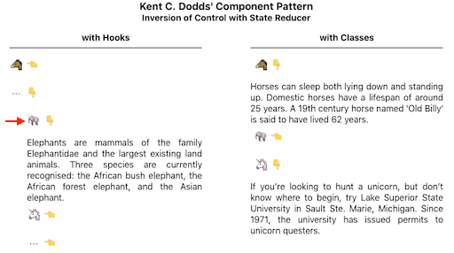

## Inversion of Control Software Pattern

### 1. from Kent C. Dodds

---

This is a place to play with Kent's very cool software pattern that
gives client's of your React components tremendous power and flexibility to extend your
work visually and behaviorally while keeping the code relatively compact
and maintainable.

The work comes from his 'Simply React' keynotes in which he walks through the evolution of an Accordion component with class-based (2018) and hooks-based (2020)
implementations.

Behavior is extended through a diy state reducer that augments the bundled accordion reducer.


### 2. Nested Accordion

I'm extending Kent's Accordion model to include layout and input data reducers in support of a nested accordion:

---



#### Here is what the input data looks like:

App.js

```
const nestedItems = [
  {
    title: '🐴',
    contents: (
      <div>
        Horses can sleep both lying ...
      </div>
    )
  },
  {
    title: '⋯',
    items: [
      {
        title: '🐘',
        contents: (
          <div>
            Elephants are mammals of the ...
          </div>
        )
      },
      ...
    ]
  }
  ...
]

function App() {
  return (<Accordion items={nestedItems} />)
}
```

---

Accordion.js

```
import React from 'react'
import { useAccordion } from './useAccordion'

function Accordion({ items, ...props }) {
  const { components } = useAccordion({ items })
  return <div>{components}</div>
}

export { Accordion }
```

---

useAccordion.js

```
...

// Support indented layouts ...

function dfltLayoutReducer(components, action) {
  switch (action.type) {
    case layoutActionTypes.map_items:
      return action.items.map((item, index) => {
        if (isVisible(item, action.items, action.expandedItems)) {
          return (
            <AccordionItem
              key={`${item.depth}_${item.title}_${index}`}
              direction="vertical"
              indent={item.depth}
            >
              {createButton(
                index,
                action.expandedItems.includes(index),
                action.toggleItem,
                item.title,
                '👇',
                '👈'
              )}
              {createContents(
                action.expandedItems.includes(index),
                item.contents
              )}
            </AccordionItem>
          )
        }
        return createEmptyItem(item.depth, index)
      })
    default: {
      throw new Error(
        'Unhandled type in Accordion dfltLayoutReducer: ' + action.type
      )
    }
  }
}

// Flatten nested input json into a single dimension
// array, augmented with knowledge of parent index
// to support visibility calculation in layout reducer.

function flattenItemsReducer(nestedItems, depth = 0, acc = [], parent) {
  const flattenedItems = nestedItems.reduce((acc, item, index) => {
    const hasNestedItems = item.items
    if (hasNestedItems) {
      acc.push({
        title: item.title,
        contents: undefined,
        depth: depth,
        parent: parent
      })
      const newParent = acc.length - 1
      return flattenItemsReducer(item.items, depth + 1, acc, newParent)
    } else {
      acc.push({
        ...item,
        depth: depth,
        parent: parent
      })
    }
    return acc
  }, acc)
  return flattenedItems
}

const dfltInputItemsReducer = flattenItemsReducer

function useAccordion({
  layoutReducer = dfltLayoutReducer,
  inputItemsReducer = dfltInputItemsReducer,
  items = [],
  initialExpanded = []
} = {}) {
  const normalizedItems = useRef(inputItemsReducer(items))
  const { expandedItems, toggleItem } = useExpandable({
    initialState: initialExpanded
  })
  const memoizedToggleItem = useCallback(toggleItem, [])

  const memoizedLayoutReducer = useCallback(layoutReducer, [])
  const [components, dispatch] = useReducer(memoizedLayoutReducer, [])

  useEffect(() => {
    dispatch({
      type: layoutActionTypes.map_items,
      items: normalizedItems.current,
      toggleItem: memoizedToggleItem,
      expandedItems: expandedItems
    })
    return
  }, [normalizedItems, memoizedToggleItem, expandedItems])
  return { components }
}
```
