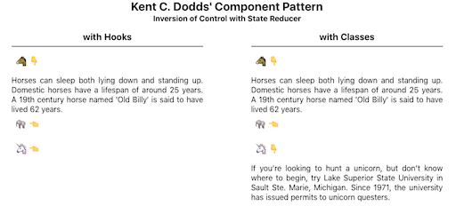

## Inversion of Control Software Pattern

### _Fighting prop-bloat and maintenance blues in your React components_

<h5>&nbsp;</h5>


_<h6>Photo by <a href="https://unsplash.com/@rxcroes?utm_source=unsplash&amp;utm_medium=referral&amp;utm_content=creditCopyText">Raoul Croes</a>_

<h5>&nbsp;</h5>

## tl;dr

---

Extend Kent C Dodds' inversion of control behavior-reducer pattern to include:

- input data reduction
- layout reduction

to create a nested Accordion

<h5>&nbsp;</h5>

## Imagine ...

---

You've written a new _Accordion_ component with a set of props to support a reasonable collection of use-cases. You want to share your work with others, so you publish and blog a bit. You feel great.

<h5>&nbsp;</h5>

 _<h6>Photo by <a href="https://unsplash.com/@stobbewtf?utm_source=unsplash&amp;utm_medium=referral&amp;utm_content=creditCopyText">Christian Paul Stobbe&nbsp;&nbsp;&nbsp;&nbsp;&nbsp;&nbsp;</a>_

<h5>&nbsp;</h5>

In time, the gods of SEO and open source smile and you're rewarded with the blessings of growing interest and adoption. You bask in the glow of acknowledged value and happily respond to the natural influx of feature requests.

<h5>&nbsp;</h5>

 _<h6>Photo by <a href="https://unsplash.com/@dryanparker?utm_source=unsplash&amp;utm_medium=referral&amp;utm_content=creditCopyText">Ryan Parker</a>_

<h5>&nbsp;</h5>

With popularity, comes a steady drum beat of new questions, use-cases, and bug reports. Some in the community offer PRs, thankfully, but these are not free as they require time and effort to consider and shape.

Your prop count grows. You diligently add test cases for the scenarios you at least understand but feel less definitive about others, especially the ones you'll never need yourself, frankly.

<h5>&nbsp;</h5>

 _<h6>Photo by <a href="https://unsplash.com/@t_ahmetler?utm_source=unsplash&amp;utm_medium=referral&amp;utm_content=creditCopyText">Tolga Ahmetler</a>_

<h5>&nbsp;</h5>

As code complexity grows, it's hard keeping up with the demand for modifications while still maintaining quality. The crisp coherence of your original component morphs into a maintenance muddle.

No good deed goes unpunished. Has your gift to the world become a curse, an albatross around your neck?

<h5>&nbsp;</h5>


_<h6>By <a href="https://en.wiktionary.org/wiki/albatross_around_one%27s_neck">
Gustave Doré, 1876</a>
[ <a href="https://commons.wikimedia.org/wiki/Template:PD-US">CC-PD-Mark</a> ]_

<h5>&nbsp;</h5>

Is there way to pass control _back_ to the flock of eager adoptees with an implementation that _encourages_ extension without having to rewrite the underlying component at each turn?

<h5>&nbsp;</h5>

## Solution: Inversion of Control

### _Bring Your Own Behavior Reducer_

---

I've recently become a fan of [Kent C. Dodds](https://kentcdodds.com) after watching his two **'Simply React'** keynotes from [2018](https://youtu.be/AiJ8tRRH0f8) and [2020](https://youtu.be/5io81WLgXtg) where he discusses 'inversion of control' in the context of a highly extensible Accordion component.

<h5>&nbsp;</h5>



<h5>&nbsp;</h5>

The key points are:

- expose layout logic for easy modification by clients
- support extensible component behavior through chainable, developer-supplied state reducers

Importantly, you still craft reasonable defaults for layout and behavior to meet your needs (and hopefully those of many others). However, if you allow one or more DIY behavior reducers to be passed in, then you may side-step the need to anticipate or laboriously support variant policies such as:

- only allow 1 visible item at a time
- require at least 1 item be visible at all times
- allow multiple visible items

<h5>&nbsp;</h5>
Here's what the code might look like for enforcing the first two bullets:
<h5>&nbsp;</h5>

```javascript
import React from 'react'
import { Accordion } from './Accordion'
import {
  combineExpansionReducers,
  preventCloseReducer,
  singleReducer,
} from './useExpandable'

const items = [
  {
    title: '🐴',
    contents: (
      <div>
        Horses can sleep both lying down and ...
      </div>
    )
  },
  ...
]

function App() {
  return (
    <Accordion
      items={items}
      expansionReducer={combineExpansionReducers(
        singleReducer,        // :-)
        preventCloseReducer   // :-)
      )}
    />
  )
}
```

<h5>&nbsp;</h5>

The optional `expansionReducer` prop is key.

<h5>&nbsp;</h5>

An expansion reducer manages a stateful array of indices which controls the visibility of Accordion items.

During render, entries in the `expandedItems` array are injected into lower-level components as `isOpen` props:

<h5>&nbsp;</h5>

```javascript
# useAccordion.js

  (
    <AccordionItem>
      ...
      <AccordionContents
        isOpen={action.expandedItems.includes(index)}> // :-)
        {contents}
      </AccordionContents>
    </AccordionItem>
  )

```

<h5>&nbsp;</h5>

which control expandable divs ...

<h5>&nbsp;</h5>

```javascript
# useAccordion.js

import posed from 'react-pose'

const PoseAccordionContents = posed.div({
  open: { maxHeight: 200 },
  closed: { maxHeight: 0 }
})

function AccordionContents({ isOpen, ...props }) {
  return (
    <PoseAccordionContents
      pose={isOpen ? 'open' : 'closed'}  // :-)
      style={{ overflowY: 'hidden', textAlign: 'justify' }}
      {...props}
    />
  )
}
```

<h5>&nbsp;</h5>

By default, a user may click to open multiple items.

As a developer, however, you may _override_ that behavior by redefining which reducers will fire in response to item clicks via the `expansionReducer` prop (as shown in the code above.) You may even roll your own behavior reducer if you don't like the ones exported by the useExpandable module.

Control is _inverted_ by enabling the component consumer to extend behavior in their scope rather than wedging their novel use-case into the underlying component.

<h5>&nbsp;</h5>

Hmm ... that gives me an idea.

<h5>&nbsp;</h5>

I've been messing with so called menu drawers that open to the side of the main content and allow a user to navigate a hierarchy of selectable options. The options themselves often expand to reveal sub-options. The expansion behavior of the accordion reminds me of that.

Could I create my own Accordion state reducer to enable _nested_ Accordions ... as a step toward a drawer list component?

<h5>&nbsp;</h5>

## Nested Accordion

### _Creating a recursive Accordion_

---


_<h6>Photo by <a href="https://unsplash.com/@nunchakouy?utm_source=unsplash&amp;utm_medium=referral&amp;utm_content=creditCopyText">Jossuha Théophile</a>_

<h5>&nbsp;</h5>

I want something that looks like this:

<h5>&nbsp;</h5>


<h5>&nbsp;</h5>

with recursively defined input data:

<h5>&nbsp;</h5>

```javascript
# App.js
import React from 'react'
import { Accordion } from './Accordion'

const nestedItems = [
  {
    title: '🐴',
    contents: (
      <div>
        Horses can sleep both lying ...
      </div>
    )
  },
  {
    title: '⋯',
    items: [        // <--- the recursive bit
      {
        title: '🐘',
        contents: (
          <div>
            Elephants are mammals of the ...
          </div>
        )
      },
      ...
    ]
  }
  ...
]
```

<h5>&nbsp;</h5>

and a usage pattern that looks very similar to what we've seen already:

<h5>&nbsp;</h5>

```javascript
# App.js

function App() {
  return (
    <Accordion
      items={nestedItems}
      expansionReducer={???}
    />
  )
}
```

<h5>&nbsp;</h5>

The first challenge are the input data. The current render process maps across a linear array of items:

<h5>&nbsp;</h5>

```javascript
const items = [
  {
    title: '🐴',
    contents: (
      <div>
        Horses can sleep both lying down and ...
      </div>
    )
  },
  {
    title: '🐘',
    contents: (
      <div>
        Elephants are mammals of the family Elephantidae ...
      </div>
    )
  },
  ...
]

... // hand waving

(
  return items.map((item, index) => (
    return <AccordionItem>...</AccordionItem>
  ))
)
```

<h5>&nbsp;</h5>

But we have a nested input schema. Either we need to make the render recursion-friendly or somehow flatten the input data before it gets mapped.

I opt for the latter to minimize changes to the underlying component since that's the point of this pattern.

I come up with this:

<h5>&nbsp;</h5>

```javascript
function flattenItemsReducer(nestedItems, depth = 0, acc = [], parent) {
  const flattenedItems = nestedItems.reduce((acc, item, index) => {
    const hasNestedItems = item.items
    if (hasNestedItems) {
      acc.push({
        // parent node
        title: item.title,
        contents: undefined,
        depth: depth,
        parent: parent
      })
      const newParent = acc.length - 1
      return flattenItemsReducer(item.items, depth + 1, acc, newParent)
    } else {
      acc.push({
        // child node
        ...item,
        depth: depth,
        parent: parent
      })
    }
    return acc
  }, acc)
  return flattenedItems
}
```

<h5>&nbsp;</h5>

This linearizes our nested input data into a 1-dimensional array by injecting
`parent nodes` just above their children.

It also adds a `depth` property to the item schema so we can reason about _hierarchies of visibility_, layout indentation, and peer-centric behavior.

Out of expedience, I break my own rule and wedge this into `useAccordion.js` for now. Heh, that didn't take long. I suspect _some_ of Kent's code will get refactored as I hear the siren call of an `inputItemsReducer` prop even as I'm mindful to avoid hasty abstractions. The nice thing about this reducer, I further rationalize, is it works with flat _and_ nested input data.

Here's how it integrates into the useAccordion hook:

<h5>&nbsp;</h5>

```javascript
# useAccordion.js
import {
  useExpandable,
  multiExpandedReducer as dfltExpansionReducer
} from './useExpandable'

function useAccordion(items = []) {
  // Flatten input items as necessary. :-)
  const normalizedItems = useRef(flattenItemsReducer(items))

  // Gain access to stateful array of expandedItems (for layout)
  // managed by Kent's extensible state reducers.
  const { expandedItems, toggleItem } = useExpandable({
    initialState: [],
    reducer: dfltExpansionReducer,
    items: normalizedItems.current
  })

  // Watch this space :-)
  useEffect(() => trigger_component_layout()), [???])
  return { components }   // somehow ...
}
```

<h5>&nbsp;</h5>

Next we consume the flattened data by passing it to a layout reducer:

<h5>&nbsp;</h5>

```javascript

# useAccordion.js

function verticalBelowLayoutReducer(components, action) {
  switch (action.type) {
    case layoutActionTypes.map_items:
      return action.items.map((item, index) => {
       if (isVisible(item, action.items, action.expandedItems)) {
          return (
            <AccordionItem
              key={`${item.depth}_${item.title}_${index}`}
              direction="vertical"
              indent={item.depth}
            >
              {createButton(
                index,
                action.expandedItems.includes(index),
                action.toggleItem,
                item.title,
                '👇',
                '👈'
              )}
              {createContents(
                action.expandedItems.includes(index),
                item.contents
              )}
            </AccordionItem>
          )
        }
        return createEmptyItem(item.depth, index)
      })
    default: {
      throw new Error(
        'Unhandled type in verticalBelowLayoutReducer: ' +
          action.type
      )
    }
  }
}

...

function useAccordion(items) {
  // Flatten input items as necessary.
  const normalizedItems = useRef(flattenItemsReducer(items))

  // Gain access to stateful array of expandedItems (for layout)
  // managed by Kent's extensible state reducers.
  const { expandedItems, toggleItem } = useExpandable({
    initialState: [],
    reducer: expansionReducer,
    items: normalizedItems.current
  })
  const memoizedToggleItem = useCallback(toggleItem, [])

  // Watch this space :-)

  // Turn verticalBelowLayoutReducer() into a true layout reducer
  // ... so we can return React components to caller
  const memoizedLayoutReducer = useCallback(verticalBelowLayoutReducer, [])
  const [components, dispatch] = useReducer(memoizedLayoutReducer, [])

  // ... and dispatch layout actions sync'd to caller's render
  useEffect(() => {
    dispatch({
      type: layoutActionTypes.map_items,
      items: normalizedItems.current,
      toggleItem: memoizedToggleItem,
      expandedItems: expandedItems || []
    })
    return
  }, [normalizedItems, memoizedToggleItem, expandedItems])
  return { components }
}

```

<h5>&nbsp;</h5>

Finally, I implement the recursive analog of the `singleReducer` that allows at most a single item to be expanded at any one time. I amend this to allow a single _peer_ item to be visible at a time:

<h5>&nbsp;</h5>

```javascript

# App.js

import { actionTypes as expandableActionTypes } from './useExpandable'

// Allow only one peer item at a given nested depth to be visible.

function singlePeerExpandedReducer(expandedItems = [], action) {
  function isaParent(item) {
    return item.contents === undefined
  }
  function removePeersOf(index, array, items) {
    const depth = items[index].depth
    return array.filter(
      (i) =>
        items[i].depth !== depth ||
        // don't remove peers that are parents of sub-accordions
        (items[i].depth === depth &&
          (isaParent(items[i]) || isaParent(items[index])))
    )
  }
  if (action.type === expandableActionTypes.toggle_index) {
    return expandedItems.includes(action.index)
      ? // closeIt
        expandedItems.length > 1
        ? expandedItems.filter((i) => i !== action.index)
        : undefined // allow combineReducers to chain reducers
      : // openIt
        [
          ...removePeersOf(action.index, expandedItems, action.items),
          action.index
        ]
  }
}

...

function App() {
  return (
    <Accordion
      items={nestedItems}
      expansionReducer={singlePeerExpandedReducer}
    />
  )
}

```

<h4>&nbsp;</h4>

## Summary

---

I've sketched out a nested Accordion that supports input-data and layout reducers (in addition to Kent's expansion state reducer).

Here's what I learned:

- input data reducers

  - Input data for a nested Accordion is inherently nested itself.
  - However, the layout function is currently just a map across a 1-dimensional array of items.
  - I made a _data reducer_ to linearize input items so the map would still work simply.

- layout reducers

  - The nested Accordion has unique visibility and indentation requirements not met by the original (flat) component.
  - I replaced it with an enhanced layout _reducer_ which may be passed in as an Accordion prop.

- Does this pattern deliver on its promise?

  - I did end up with some significant refactoring:

    - I split the code into two hooks, useAccordion and useExpandable.

    - I injected items into useExpandable for behaviors that depend upon knowledge of peer relationships among nodes in a hierarchy.

    - I pushed layout into its own reducer because it was cluttering the top-most driver and can still be overridden with a prop, similar to the behavior reducer.

  - I hit constraints trying to implement preventClose for nested Accordions since combineReducers is not a true pipeline but a sequence of all-or-nothing invocations of a reducer set.

  - I unearthed two more reducer patterns which could enhance inversion of control.

  - I like this pattern a lot but also realize there's still room in the world for _dumb_ props (like `max_viewable_items` and `min_viewable_items`) that may obviate the need for passing in full-fledged reducers. But I take Kent's larger point about the slippery slope to prop purgatory. :D

Open question

- Can we decouple layout from being tied to a given component library such as Emotion or Material-UI, if it's not a hasty abstraction.
